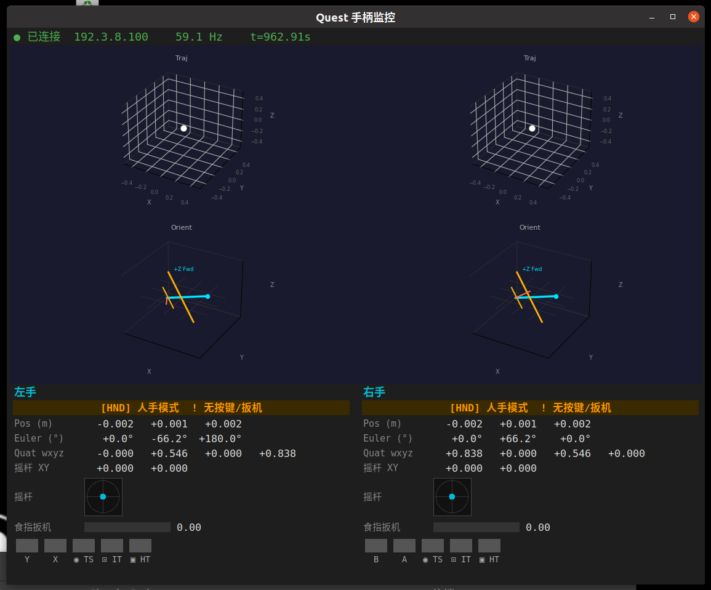
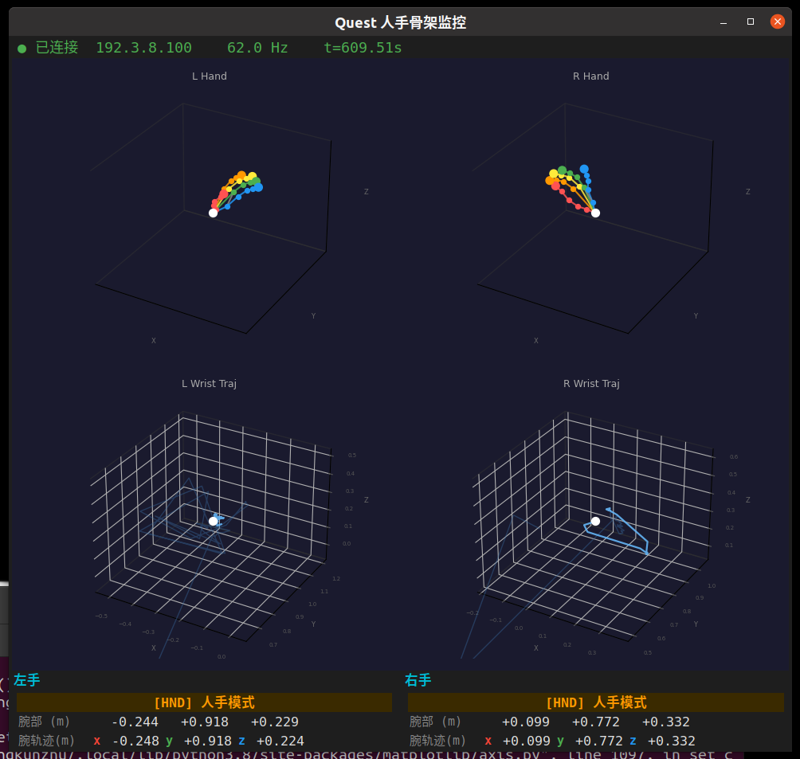

# Quest_Tele

基于 Meta Quest 3 的 VR 双手位姿采集系统，支持**手柄模式**和**人手追踪模式**，通过局域网 HTTP 实时发送至工作站，用于机器人遥操作。

---

## 目录

1. [硬件与环境要求](#1-硬件与环境要求)
2. [编译与安装 APK](#2-编译与安装-apk)
3. [配置与使用](#3-配置与使用)
4. [Python 实时监控](#4-python-实时监控)
5. [Python 数据接收与集成](#5-python-数据接收与集成)
6. [数据格式说明](#6-数据格式说明)

---

## 1. 硬件与环境要求

### 硬件
- Meta Quest 3（已验证）
- 工作站（Linux / Windows / macOS）
- USB-C 数据线
- 路由器（Quest 与工作站需在同一局域网）

### 软件
- [Unity Hub](https://unity.com/download)
- Unity Editor **2022.3.x LTS**（需勾选 Android Build Support）
- Python 3.8+（工作站端）
- `pip install matplotlib numpy`

---

## 2. 编译与安装 APK

### 2.1 安装 Unity

在 Unity Hub 中安装 **Unity 2022.3.x LTS**，必须勾选：
- Android Build Support
- Android SDK & NDK Tools
- OpenJDK

### 2.2 打开项目

```bash
git clone git@github.com:Greyman-Seu/Quest_Tele.git
```

在 Unity Hub 中 **Add** 项目，打开场景 `Assets/Scenes/Teleoperation`。

### 2.3 修改默认参数（可选）

在 Hierarchy 中选择 `Main` 对象，Inspector 中找到 `VRController` 组件：

| 参数 | 说明 | 默认值 |
|------|------|--------|
| `IP` | 工作站局域网 IP | `192.168.2.187` |
| `Port` | 监听端口 | `8082` |
| `Hz` | 发送频率 | `60` |

> IP 也可在 APP 运行时通过界面修改。

### 2.4 构建 APK

1. `File` → `Build Settings` → Platform 选 **Android** → `Switch Platform`
2. Texture Compression 选 **ASTC**
3. 点击 **Build** 生成 `.apk` 文件

### 2.5 开启开发者模式

1. 手机安装 **Meta Horizon** APP，登录同一账号
2. 进入 设备 → Quest 3 → **开发者模式** → 开启
3. 重启 Quest 3

### 2.6 通过 ADB 安装

**Linux 安装 ADB：**
```bash
sudo apt install android-tools-adb
```

**安装 APK：**
```bash
# 连接 USB，戴上头显点击"允许 USB 调试"
adb devices                        # 确认设备已识别
adb install -r path/to/Quest_Tele.apk
```

**Linux 首次使用需添加 udev 规则（Meta Quest Vendor ID = 2833）：**
```bash
echo 'SUBSYSTEM=="usb", ATTR{idVendor}=="2833", MODE="0666", GROUP="plugdev"' \
  | sudo tee /etc/udev/rules.d/51-android.rules
sudo udevadm control --reload-rules && sudo udevadm trigger
```
拔插 USB 线后重新执行 `adb devices`。

安装成功后在 Quest 应用列表的**未知来源**分类中找到 APP。

---

## 3. 配置与使用

### 3.1 网络配置

确保 Quest 3 与工作站在**同一局域网**。查看工作站 IP：

```bash
ip addr show | grep "inet "   # Linux
```

### 3.2 启动 APP

1. 在 Quest 应用列表（**未知来源**）中启动 APP
2. 在界面中输入工作站 IP，点击 **Refresh IP** 确认

### 3.3 坐标系校准

首次使用需对齐虚拟坐标系与机器人坐标系：

1. 同时按 **左手 X + 右手 A** 键，进入校准模式（屏幕出现坐标轴）
2. 按住**右手食指扳机** + 转动手腕 → 调整坐标系**旋转**
3. 按住**左手食指扳机** + 移动手柄 → 调整坐标系**原点**
4. 再次同时按 **X + A** 退出校准模式

### 3.4 追踪模式

APP 自动识别当前模式，无需手动切换：

| 模式 | 触发条件 | 可用数据 |
|------|----------|----------|
| **手柄模式** | 持握 Touch 控制器 | 位姿、按键、扳机、摇杆 |
| **人手追踪模式** | 放下控制器，伸出双手 | 位姿、24 关节坐标 |

---

## 4. Python 实时监控

提供两个独立监控窗口，根据模式分别使用：

### 4.1 手柄监控

```bash
python3 quest_monitor.py
```



**功能：**
- 左右手腕 3D 运动轨迹
- 手柄朝向姿态（飞机示意图）
- 实时数值：位置 / 欧拉角 / 四元数 / 摇杆 XY / 食指扳机
- 摇杆实时可视化（小圆点）
- 按键状态指示灯（Y/X/B/A / 摇杆按下 / 扳机 / Grip）
- 人手模式下自动冻结，显示 `[HND]` 提示

### 4.2 人手骨架监控

```bash
python3 quest_hand_monitor.py
```



**功能：**
- 左右手 24 关节 3D 骨架（彩色按指归属）
- 左右手腕空间轨迹（3D，渐变蓝色）
- 腕部实时 XYZ 坐标
- 手柄模式下自动冻结，显示 `[CTL]` 提示

### 4.3 退出监控

关闭窗口或按 `Ctrl+C` 均可正常退出。

---

## 5. Python 数据接收与集成

### 快速测试

```bash
python3 quest_receiver.py
```

终端会实时打印接收到的位姿数据。

### 在自己的程序中集成

```python
from quest_receiver import QuestReceiver

receiver = QuestReceiver(port=8082)
receiver.start()

while True:
    data = receiver.get_latest()
    if data is None:
        continue

    mode = data['rightHand']['isHandTracking']  # True=人手, False=手柄

    if not mode:
        # ── 手柄模式 ──────────────────────────────────
        r_pos    = data['rightHand']['wristPos']       # [x, y, z] 米
        r_quat   = data['rightHand']['wristQuat']      # [w, x, y, z]
        r_trig   = data['rightHand']['triggerState']   # float [0, 1]
        r_stick  = data['rightHand']['thumbstick']     # [x, y]  [-1, 1]
        r_btns   = data['rightHand']['buttonState']    # list[bool] × 5

        l_pos    = data['leftHand']['wristPos']
        l_quat   = data['leftHand']['wristQuat']
        l_trig   = data['leftHand']['triggerState']
        l_stick  = data['leftHand']['thumbstick']
        l_btns   = data['leftHand']['buttonState']

    else:
        # ── 人手追踪模式 ───────────────────────────────
        r_pos    = data['rightHand']['wristPos']       # [x, y, z] 米
        r_quat   = data['rightHand']['wristQuat']      # [w, x, y, z]
        r_joints = data['rightHand']['jointPos']       # list[float] × 72
        # jointPos 展开为 (24, 3)：
        # import numpy as np
        # joints = np.array(r_joints).reshape(24, 3)

        l_pos    = data['leftHand']['wristPos']
        l_quat   = data['leftHand']['wristQuat']
        l_joints = data['leftHand']['jointPos']

    # 头显位姿（始终有效）
    head_pos  = data['headPos']    # [x, y, z]
    head_quat = data['headQuat']   # [w, x, y, z]
    ts        = data['timestamp']  # float，APP 运行时间（秒）
```

---

## 6. 数据格式说明

APP 以 **HTTP POST / JSON** 方式发送至 `http://{IP}:{Port}/unity`，默认 60 Hz。

### 顶层结构

| 字段 | 类型 | 说明 |
|------|------|------|
| `timestamp` | `float` | APP 运行时间，单位秒 |
| `rightHand` | `HandMessage` | 右手数据 |
| `leftHand` | `HandMessage` | 左手数据 |
| `headPos` | `[x, y, z]` | 头显位置，单位米 |
| `headQuat` | `[w, x, y, z]` | 头显朝向四元数 |

### HandMessage 字段

| 字段 | 类型 | 有效模式 | 说明 |
|------|------|----------|------|
| `wristPos` | `float[3]` | 两种模式 | 手腕世界坐标 `[x, y, z]`，单位米 |
| `wristQuat` | `float[4]` | 两种模式 | 手腕朝向四元数 `[w, x, y, z]` |
| `isHandTracking` | `bool` | 两种模式 | `true`=人手追踪，`false`=手柄 |
| `triggerState` | `float` | 手柄模式 | 食指扳机模拟量，范围 `[0, 1]` |
| `thumbstick` | `float[2]` | 手柄模式 | 摇杆 XY 模拟量，范围 `[-1, 1]` |
| `buttonState` | `bool[5]` | 手柄模式 | 见下表 |
| `jointPos` | `float[72]` | 人手模式 | 24 关节世界坐标，展开为 `(24, 3)` |

### buttonState 索引

| 索引 | 左手 | 右手 |
|------|------|------|
| `[0]` | Y | B |
| `[1]` | X | A |
| `[2]` | 左摇杆按下 | 右摇杆按下 |
| `[3]` | 食指扳机（数字） | 食指扳机（数字） |
| `[4]` | Grip 侧边扳机 | Grip 侧边扳机 |

### jointPos 关节索引（OVRSkeleton BoneId）

| 索引 | 关节 | 索引 | 关节 |
|------|------|------|------|
| 0 | WristRoot | 12 | Ring1 |
| 1 | ForearmStub | 13 | Ring2 |
| 2 | Thumb0 | 14 | Ring3 |
| 3 | Thumb1 | 15 | Pinky0 |
| 4 | Thumb2 | 16 | Pinky1 |
| 5 | Thumb3 | 17 | Pinky2 |
| 6 | Index1 | 18 | Pinky3 |
| 7 | Index2 | 19 | ThumbTip |
| 8 | Index3 | 20 | IndexTip |
| 9 | Middle1 | 21 | MiddleTip |
| 10 | Middle2 | 22 | RingTip |
| 11 | Middle3 | 23 | PinkyTip |

> 坐标系：Unity 世界坐标系，经校准变换后输出。四元数格式统一为 `[w, x, y, z]`。

### 完整 JSON 示例

```json
{
  "timestamp": 42.35,
  "rightHand": {
    "wristPos":      [0.30, 1.10, -0.20],
    "wristQuat":     [0.98, 0.01, 0.17, 0.00],
    "isHandTracking": false,
    "triggerState":  0.85,
    "thumbstick":    [0.12, -0.45],
    "buttonState":   [false, true, false, false, true],
    "jointPos":      []
  },
  "leftHand": {
    "wristPos":      [-0.25, 0.92, -0.18],
    "wristQuat":     [0.97, 0.00, -0.22, 0.01],
    "isHandTracking": false,
    "triggerState":  0.00,
    "thumbstick":    [0.00, 0.00],
    "buttonState":   [false, false, false, false, false],
    "jointPos":      []
  },
  "headPos":  [0.00, 1.65, 0.00],
  "headQuat": [1.00, 0.00, 0.00, 0.00]
}
```

> 人手追踪模式下，`triggerState`、`thumbstick`、`buttonState` 无效（归零），`jointPos` 填充 72 个浮点数。
